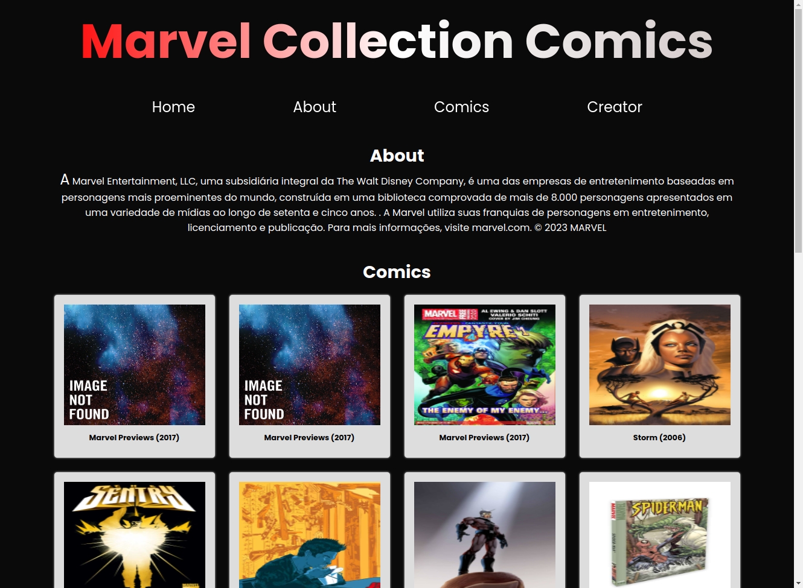

<h1 align="center">Comics Marvel | MGN </h1>

  <a href="#-tecnologias">Tecnologias</a>&nbsp;&nbsp;&nbsp;|&nbsp;&nbsp;&nbsp;
  <a href="#-projeto">Projeto</a>&nbsp;&nbsp;&nbsp;|&nbsp;&nbsp;&nbsp;
  <a href="#-redes">Redes</a>

---

  

---

## 🚀 Tecnologias

Esse projeto foi desenvolvido com as seguintes tecnologias:

- HTML
- CSS
- JavaScript
- API Marvel
- Lib SweetAlert2

## 💻 Projeto

O projeto é um desafio pessoal para consumo de API aonde realizei o consumo da API Marvel aonde é então feito um callback de algumas histórias em quadrinhos e também o consumo da biblioteca SweetAlert2 para gerar um alerta ao clicar no botão Shopp(comprar).
É um projeto totalmente responsivo para qualquer tamanho de tela desde a menor (celular) com 320px até uma com mais de 1024px.

---

## 🔗 Redes

Estas são minhas redes sociais. Sinta-se a vontade para mandar uma mensagem.

- [Linkedin](https://www.linkedin.com/in/eomgn/)
- [Instagram](https://www.instagram.com/matheuzngr/)
- [Twitter](https://twitter.com/eomgn)
